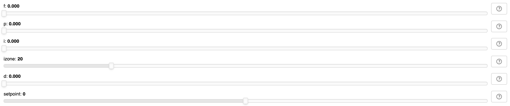
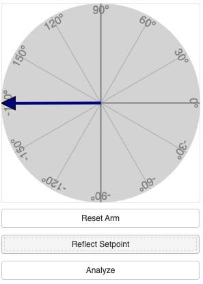
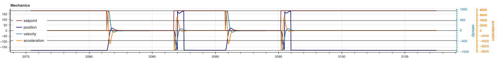
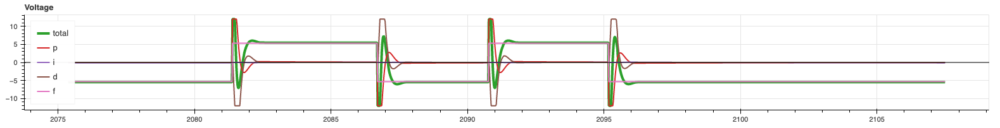
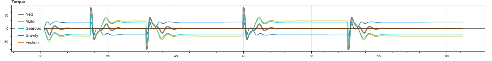
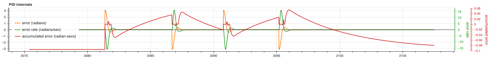

# pid_demo2

Simple demo of PID controller for arm.

Inspired by: https://www.youtube.com/watch?v=qKy98Cbcltw

Tuning a PID controller that will hold an arm out horizontally is, perhaps, the hardest possible configuration.
The torque from gravity is at a maximum, so pushing up too hard is unstable.  Feedforward is not going to be enough.

While I have tried to make this a reasonable physics simualtor, you should not use it to select gear ratios.

## Quickstart

1. Click on the "Launch Binder" badge above.  Open in a new window so you can keep reading these instructions.  It may take few minutes to start up, so do it now.
   * If this fails, just try again.  Sometimes not enough of the stack is in the cache, so it times out.
1. Select a BAG motor, with a 150 gear ratio and a mass of 5kg.  (See [image below](#scenario-configuration).)
1. Increase `f` until the arm is approaching horizontal but not spinning.  
   * Use the "Reset Arm" button to restart if things start going too fast. 
   * Add a little bit of `d` to slow things down.
1. Add some `p` to pull it towards the setpoint, but avoid too much overshoot.
1. If it's not quite getting there, add some `i`.
    * If your residual error is more than 20°, you may need to increase the `izone`.  If less, then you can decrease it.
    * Try to add the minimum `i` you can get away with because this can also increase overshoot.
1. Once you have the arm horizontal and steady, gently tune the `f` to match the total line on the voltage chart (or slightly below).
1. Use the "Reflect Setpoint" button to flip the arm from side to side.  Is it getting to the new setpoint quickly?  Is it stopping in time? 
   * Tune the `d` to reduce overshoot without slowing things down.
1. Click "Analyze" to get a report on how well your settings work in terms of overshoot, settling time, and steady state error.
   * A little overshoot is usually acceptable, but keep it under 2%.  Think about having a stadium full of spectators watching your robot's arm wiggle back and forth.
   * Try to get your settling time down as low as possible.  Can you do it in less than a second?
   * You want your steady state error to be zero, or close to it.   What size of error is too small to affect gameplay?
1. Try doubling the mass of the arm (perhaps because you picked up a game piece) and see if your settings still work.
1. Will the same settings work to bring the arm to a different angle, like straight up?
1. Did we pick the best gear ratio?
1. What if we used a different motor?

## Parts of the interface

## Scenario configuration

This can be used to configure the robot arm we're modelling.

## PID controls

These are the controls that allow you to tune the feedforward and PID feedback controller.
* `f` is measured in output (±1) for cosine of setpoint.
* `p` is measured in output per radian of error.
* `i` is measured in output per radian per second of accumulated error.
* `d` is measured in output seconds per radian of error rate.
* `izone` is shown in degrees for convenience
* `setpoint` is shown in degrees for convenience

## Animation

This shows a real-time view of the robot arm.

The "Reset Arm" button points the arm straight down (-90°), and gives it zero velocity.

The "Reflect Setpoint" button reflects the setpoint around a vertical axis.

The "Analyze" button reports:
* Overshoot: Shows as an unsigned percentage of the initial error.
* 2% Settling Time: Shown as the number of seconds elaspse before the error thereafter stays within an interval sized at 2% of the initial error for a sufficient time.  This interval may not contain the setpoint.
* Steady State Error: Mean of error within settled window, shown as percentage of initial error.
Note that the analysis will report failure to settle when the initial position is also the setpoint.

## Mechanics chart

* Setpoint and current position in degrees according to scale at left.  Note that the scale is periodic so +180° and -180° are the same point.  When the position crosses that line, it is shown as a vertical line.
* (Angular) velocity in degrees per second.  Scale is shown at right.
* (Angular) acceleration in degrees per second per second.  Scale is shown at right.

## Voltage chart

The voltage is calculated by adding together the contributions from feedforward (f), proportional (p), intergral (i), and derivative(d).  All voltage values are (separately) capped at a nominal ±12v.

## Torque chart

Five different torques are shown, all measured in Newton-metres:
* Motor: This is the output of the motor (which is different from what is sometimes referred to as "motor torque")
* Gearbox: This is the output of the gearbox after gearbox efficiency is taken into account.
* Friction: Friction in the bearing.  Proportional to the load mass and opposed to current velocity.
* Gravity: The weight of the arm, acting through its midpoint.
* Nett: Sum of gearbox, friction, and gravity.  This is the input to the acceleration calculation.
When the arm is stationary, the nett torque must be zero; neglecting friction the gearbox and gravity torques will balance.

## PID internals chart

This shows what's going on inside the PID controller.
* Error: The difference between the setpoint and position.  Shown in radians on scale at left.  This is periodic, so +π and -π are equivalent.
* Error Rate: The difference between the current error and the last error divided by the timeslice.  An approximation of the derivative of the error.  Shown in radians per second on scale at right.  Note that this will often be opposed to the error term.
* Accumulated error.  Sum of error terms multiplied by the timeslice.  Zeroed when outside izone.  An approximation of ther integral of the error.   Shown in radian-seconds on scale at right.  This will typically remain small, but will grown when everything else has settled down.
